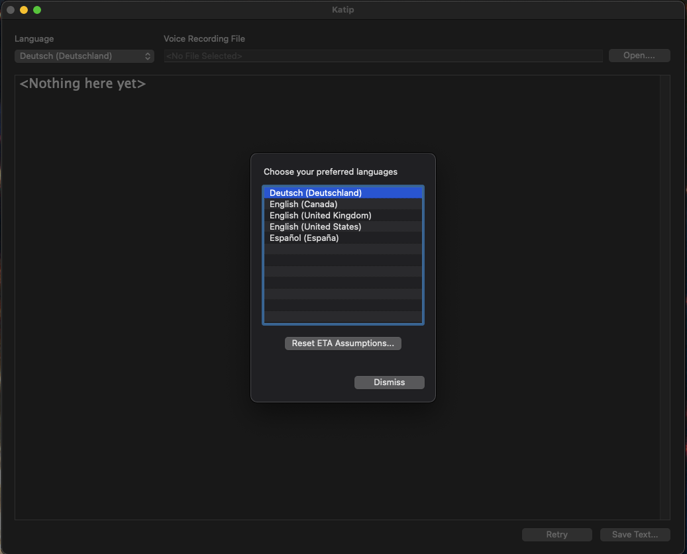
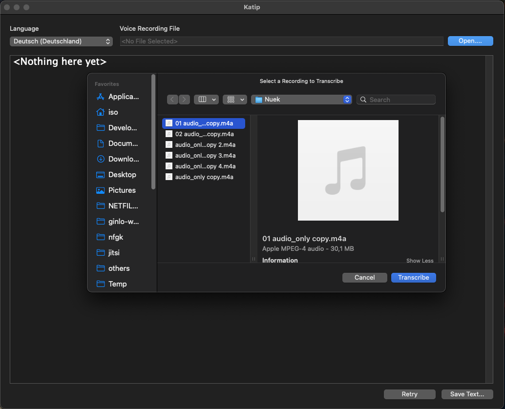
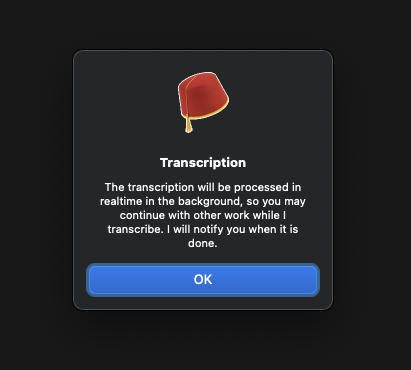
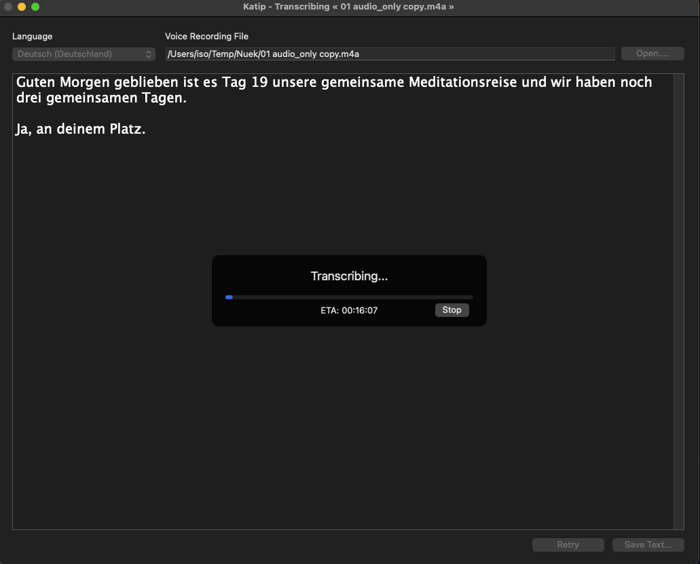
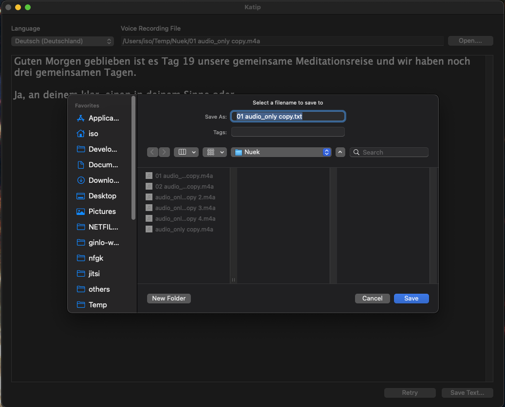

# Katip Usage

After downloading and installing *Katip* by dragging it into your `Applications`-folder, just double-click to start it.

There is only one window.

## Preferences

In the preferences, you can choose your favorite languages that you want to be shown in the language popup in the main window.

You can also reset the ETA assumptions as described in the [README file](README.md). See screenshot:

## Main Window

Please choose an audio file by clicking on the **Open**-button as shown in the below screenshot.

After choosing a file and clicking on **Transcribe**, you will see the following dialog:

Click **OK** and everything will be fine...

> WARNING: It will take some time for the first text to materialize in the window, please be patient!

Once your transcription is finished, you can click on **Save Text...** to save the trascription of your
dictation.

That's it, there is not much more. If you don't like the transcription, you can **Retry**. Sometimes this
delivers different results, but it is very rarely.

**NOTE**: You can, at any time, cancel the transcription. You can also, during the transcription, put *Katip* into
background and continue your daily work. It will notify you with when it is ready (if you have enabled notifications).

Have fun!
