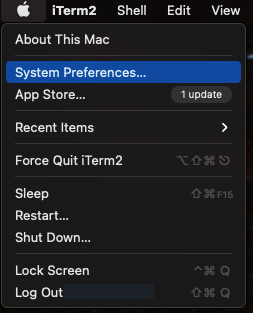
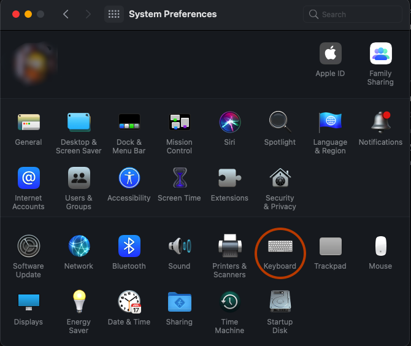
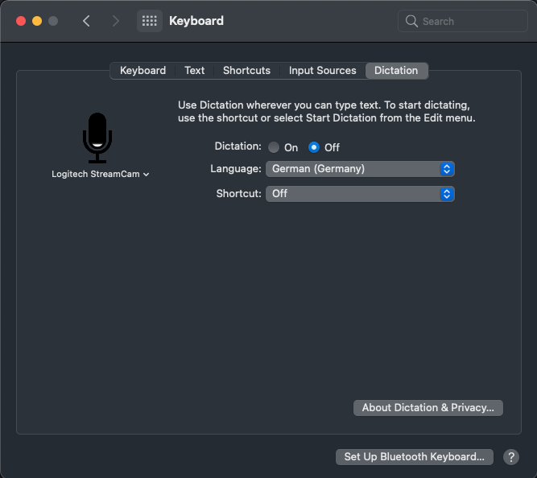
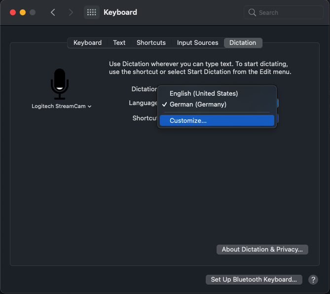
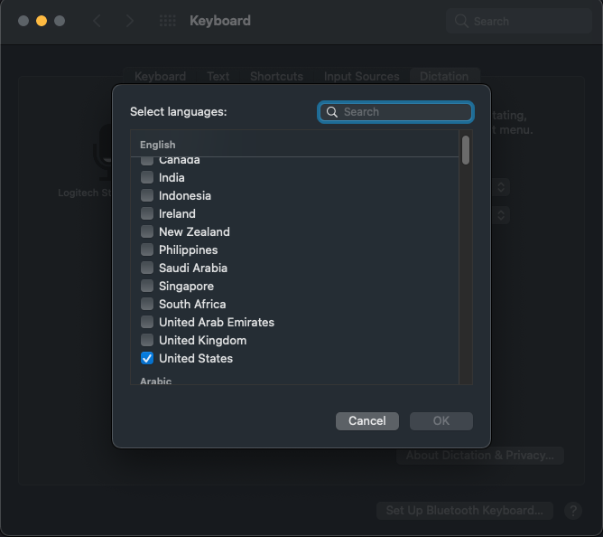

# Katip

A simple `SFSpeechRecognizer`-based Voice Recording transcriber for macOS.

If you have voice recordings (dictations) that you would like to transcribe using
your macOS computer, you can use this application to do so.

The voice-recordings must be in `mp3`, `m4a`, `wav`, or `mpa`-format (mor formats
may be possible, haven't tested yet).

**Katip** will require local transcription capabilities; it does not use Apple's
servers, otherwise the transcription would be limited to a few seconds.

Depending on the performance of your local macOS computer, the transcription may 
happen in somewhere between realtime and 3-4x real-time speed. Please be patient.

## The name

You may ask what **Katip** means and why I called it that way and why there is a
fez as application icon.

The [wise Wikipedia has the answer](https://en.wikipedia.org/wiki/Uska_Dara):

> Uska Dara (A Turkish Tale) is a 1953 song made famous by Eartha Kitt, 

... which is, actually wrong. The original title is *"Üsküdar'a giderken"*, meaning
*while on my way to Üsküdar*, where **Üsküdar** is district of Istanbul and 
in those days it was probably a suburb of Istanbul...

> also recorded by Eydie Gormé. It is based on the Turkish folk song 
> Kâtibim about a woman and her secretary traveling to Üsküdar. On 
> early American recordings, this adaptation is credited to Stella Lee.

Basically, *Kâtibim* means "my Katip" and "Katip" is a male secretary. 

In olden days in Turkey, many people could not or would not want to write themselves
and thus there were *Katip* who would write for other people. Sometimes you had your
own *Katip* (provided you were rich enough to pay for a full-time *Katip*).

That's the background of the title: **Katip = your (male) secretary**

I recommend to listen to the [Eartha Kitt version of the song on YouTube](https://www.youtube.com/watch?v=sVXFDtC_gqk).

## Setup

You need to tell macOS which languages you want to have offline transcription support. In this case, 
macOS will download a speech-data for your language and then you can perform your transcript. 
You have to do this for every language you want to use.

To do so, follow the guidelines:

### 1. Select "System Preferences" from the Apple-Menu

### 2. Select "Keyboard"

### 3. Select "Dictation"

### 4. Select "Customize..." from "Language"-Menu

### 5. Choose your languages

## Requests

If you have any requests, please do not hesitate to open an issue.

## ETA Assumptions
`SFSpeechRecognizer` can't estimate how long the transcription will take. The user, 
though, would like to know how long it *may* take. The solution I have come up is
actually easy:

> It seems, the time it takes is dependent on machine and load on the machine. 
> The load itself doesn't some to influence too much. So, the first time you 
> run the software on a machine in your account, it will show an **indeterminate** 
> progress bar. It will tell you that it might take as much as the duration of 
> your audio recording.
>
> At the end of each recording, it will check how long it actually took. And starting
> with the second transcription, it will have better and better estimates and will
> display a **determinate** progress bar.
>
> If you think the timing sucks, you can reset all assumptions in the preferences.

Have fun.

## License

Copyright 2021 Imdat Solak

Redistribution and use in source and binary forms, with or without modification, are 
permitted provided that the following conditions are met:

1. Redistributions of source code must retain the above copyright notice, this list 
   of conditions and the following disclaimer.

2. Redistributions in binary form must reproduce the above copyright notice, this 
   list of conditions and the following disclaimer in the documentation and/or other 
   materials provided with the distribution.

3. Neither the name of the copyright holder nor the names of its contributors may be 
   used to endorse or promote products derived from this software without specific 
   prior written permission.

THIS SOFTWARE IS PROVIDED BY THE COPYRIGHT HOLDERS AND CONTRIBUTORS "AS IS" AND ANY 
EXPRESS OR IMPLIED WARRANTIES, INCLUDING, BUT NOT LIMITED TO, THE IMPLIED WARRANTIES 
OF MERCHANTABILITY AND FITNESS FOR A PARTICULAR PURPOSE ARE DISCLAIMED. IN NO EVENT 
SHALL THE COPYRIGHT HOLDER OR CONTRIBUTORS BE LIABLE FOR ANY DIRECT, INDIRECT, 
INCIDENTAL, SPECIAL, EXEMPLARY, OR CONSEQUENTIAL DAMAGES (INCLUDING, BUT NOT LIMITED 
TO, PROCUREMENT OF SUBSTITUTE GOODS OR SERVICES; LOSS OF USE, DATA, OR PROFITS; OR 
BUSINESS INTERRUPTION) HOWEVER CAUSED AND ON ANY THEORY OF LIABILITY, WHETHER IN 
CONTRACT, STRICT LIABILITY, OR TORT (INCLUDING NEGLIGENCE OR OTHERWISE) ARISING IN 
ANY WAY OUT OF THE USE OF THIS SOFTWARE, EVEN IF ADVISED OF THE POSSIBILITY OF SUCH 
DAMAGE.
